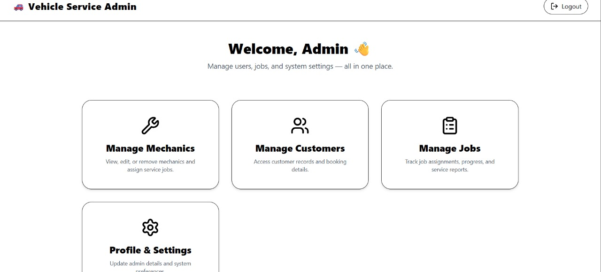
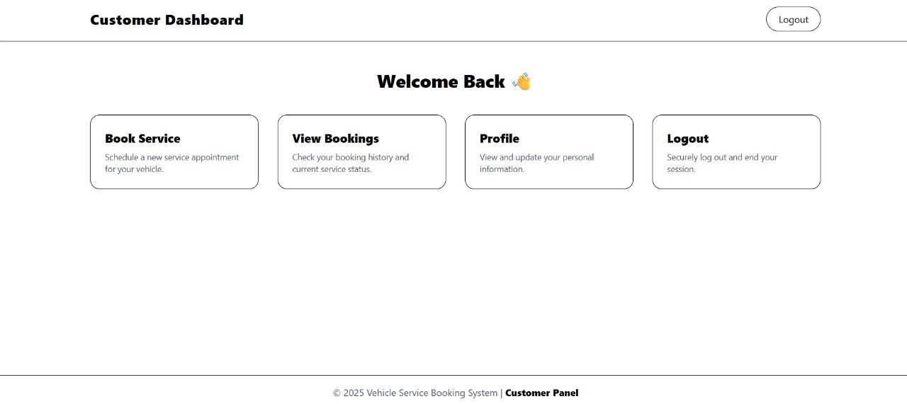
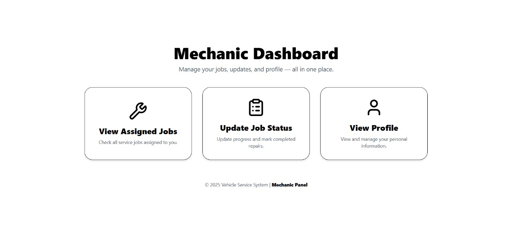

# 🚗 Vehicle Service Booking System
The **Vehicle Service Booking System** is a full-stack web application designed to manage vehicle service operations efficiently across three user roles:

- **Customer:** Books vehicle services and views booking status.  
- **Admin:** Manages users (customers & mechanics) and assigns service jobs.  
- **Mechanic:** Views assigned jobs and updates repair status.

This project demonstrates **frontend-backend integration**, **role-based functionality**, and **modular web design** for organized and realistic implementation.
It consists of a Spring Boot backend and a **Vite** + **Tailwind** + **React js** frontend.

### 🧑‍💼 Admin Dashboard


### 👤 Customer Dashboard


### 🔧 Mechanic Dashboard


## Features

| Category            | Feature                      | Description                                                         |
| ------------------- | ---------------------------- | ------------------------------------------------------------------- |
| **Authentication**  | 🔐 JWT Security              | Secures API endpoints with JSON Web Tokens for authorized access.   |
| **Mail Service**    | ✉️ SMTP Integration          | Sends password reset emails for “Forgot Password” functionality.    |
| **API Design**      | 🌍 REST APIs                 | RESTful endpoints for all CRUD operations and data exchange.        |
| **Role Management** | 🧍 Admin, Customer, Mechanic | Each user role has unique permissions and dashboards.               |
| **Job Management**  | 🧰 Assign & Track Services   | Admin assigns jobs, and mechanics update job completion.            |
| **Frontend UI**     | 💻 Responsive Design         | User-friendly and clean dashboard layout.                           |
| **Database Layer**  | 💾 MySQL + JPA               | Handles persistent storage for users, services, and jobs.           |
| **Security**        | 🔒 Token-Based Access        | Protects against unauthorized access using JWT-based auth.          |
| **Email Service**   | 📧 Password Recovery         | Automatically sends reset links via email using SMTP.               |
| **API Testing**     | 🧪 Postman Tested            | All endpoints verified through Postman and tested with sample data. |

## 🗂️ Folder Structure

<pre> ```plaintext 📁 project-submission-exp-9-10-subhankarkr/ │ ├── backend/ # Spring Boot backend │ ├── src/main/java/com/vehicle/servicebooking/ │ │ ├── controller/ # REST controllers │ │ ├── entity/ # JPA entities │ │ ├── repository/ # Data access layer │ │ ├── service/ # Business logic │ │ ├── config/ # Security & CORS settings │ │ └── VehicleServiceBookingApplication.java │ ├── src/main/resources/ │ │ └── application.properties # DB & SMTP configuration │ └── pom.xml │ ├── frontend/ # React + Vite + Tailwind frontend │ ├── public/ │ │ └── index.html │ ├── src/ │ │ ├── Admin/ │ │ ├── Customer/ │ │ ├── Mechanic/ │ │ ├── Auth/ │ │ └── App.js │ └── package.json │ └── README.md # Project documentation ``` </pre>

## Tech Stack

| **Layer**            | **Technology / Tools Used**                                      |
| -------------------- | ---------------------------------------------------------------- |
| **Frontend**         | ⚛️ **Vite**, **React.js**, **Tailwind CSS**                      |
| **Backend**          | ☕ **Spring Boot**, **Hibernate**, **MySQL**                      |
| **Authentication**   | 🔐 **JWT (JSON Web Token) Based Authentication**                 |
| **Build Tools**      | 🧩 **Maven** (Backend), **npm** (Frontend)                       |
| **Database**         | 🗄️ **MySQL**                                                    |
| **Mail Service**     | ✉️ **SMTP (JavaMailSender)** for Password Recovery               |
| **API Architecture** | 🌍 **RESTful APIs**                                              |
| **Testing & Tools**  | 🧪 **Postman**, **MySQL Workbench**, **VS Code** |

## 🚀 How to Run the Project

### Follow these steps to set up and run the Vehicle Service Booking System on your local system.

### 🧩 Step 1: Clone the Repository**

**Clone this project to your system using Git:**

git clone https://github.com/CU-2025/project-submission-exp-9-10-subhankarkr.git
cd project-submission-exp-9-10-subhankarkr

### ☕ Step 2: Run the Backend (Spring Boot)

**Navigate to your backend directory:**

cd backend


**Run the Spring Boot app:**

mvn clean install
mvn spring-boot:run


**Once it starts successfully, the backend runs on:**

http://localhost:8080


### ⚛️ Step 5: Run the Frontend (Vite + React + Tailwind)**

**Open a new terminal and navigate to:**

cd frontend


**Install dependencies:**

npm install


**Run the development server:**

npm run dev


**Visit your app in the browser at:**

http://localhost:5173


## 🚀 Future Enhancements

### In upcoming versions of the Vehicle Service Booking System, the following improvements can be added:


💳 Online Payment Integration – Add Razorpay or PayPal for secure service payments.
📱 Mobile App – Develop Android/iOS versions for customers and mechanics.
📊 Admin Analytics Dashboard – Show service reports and mechanic performance charts.
🔔 Real-Time Notifications – Notify users via email or push when job status changes.
📍 Mechanic Tracking – Integrate Google Maps to track mechanic location.
☁️ Cloud Deployment – Host the app on AWS or Render for real-world accessibility.


## 🧠 Vision

The goal of these enhancements is to evolve this project into a complete digital vehicle service management platform — one that supports customers, workshops, and mechanics with automation, analytics, and real-time communication.


## 🏁 End of Project

📅 Submitted by: Subhankar Kumar
💻 Project: Vehicle Service Booking System